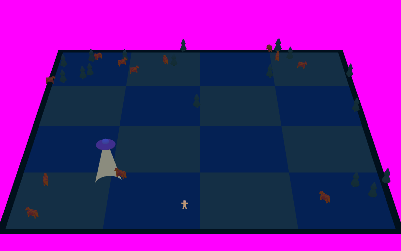
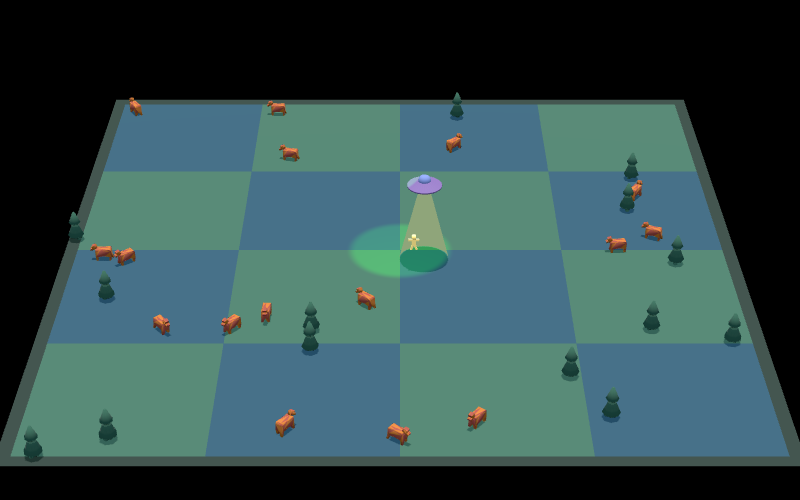
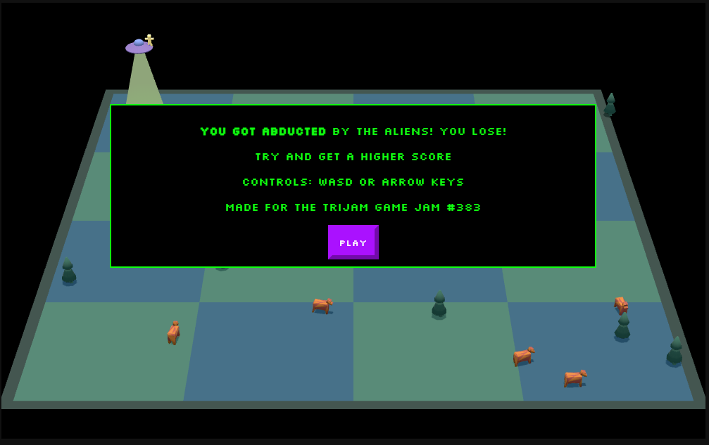

Jam home page https://itch.io/jam/trijam-383

Theme **You Were The Chosen One!**

Scoring
* Gameplay
* Visuals
* Audio
* Theme
* Enjoyment

## Dev Log

## Ideation
`16:00`

**Chosen**, like chosen by aliens for abduction.  (other considered options were Neo from the Matrix, or a hero, or a winner of something).

The word **were** could indicate that you could get out of being the chosen one

The idea is that there'sa typical UFO following you around slowly, picking up anything in its path. you can slow it down by picking up bombs or explosives or something

Movement is left-right-up-down. maybe jumping in the future.

The boiled-down gameplay can be considered from top down
* the UFO is moving in a direction. this direction can slowly turn to point towards you
* you run 1.1x as fast as the ufo moves
* the camera slides along the X axis to match the player
* the ufo has a bean (inside-out cone with backface culling), and a sotlight
* items can be as many as i want, inspired by katamari damacy
* anything under the UFO's area of effect starts to rise. once it hits a certain height, it keeps going up, and the x/y is parented to the ufo

Tools
* textures: Paint.net
* Models: Blender 3d
* Audio: Strudel REPL - if i have time

`16:04`

Let's get the project started

Then I implemented the UFO and player movement in 2d

The values to tweak are the speed difference, and the direction change speed


`16:28`

modelling, loading the scene, and setting the camera.

Setting the camera has been wasting a bit of time, and the texture won't load either, it's just black.


`17:00` (56m so far)

not accounted for - some research and code review to fix a bug

`10:06` back on it again (18m)

`10:24` 

* Added items (cubes)
* Modelled player
* added floor
* adjusted camera and stuff


`22 more minutes`

* I added models to the items (cow and tree)
* I made them get abducted (items faster)
* items disappear when they get to the top and new ones spawn



`+7m` lighting



## Day 2 - 103 minutes so far (1 hour, 43 seconds)

Outstanding tasks

* spotlight is attached to UFO ✅
* game over state ✅
* game difficulty increase
    * speed gets closer to player speed
    * turning speed increases
* stop ufo orbiting player (turning speed varies with sine wave and time?)
* more items
    * like a bomb item that pauses the ufo
    * haystacks
    * car
* hud
    * time so far ❌
    * top time ❌
    * game over state ✅
    * some instructions ✅
    * explain connection with  theme? ✅
* support for WASD too ✅
* audio ✅
    * music with theremin style from strudel ✅
    * use this with three.js https://threejs.org/docs/#Audio ✅
    * sound effects? BFXR? ❌
* stop palyer moving out of bounds ✅


`9:33` staring starting on music

strudel repl (I'm still learning)
```js
setcpm(180/4)

stack(
    note("<[d4 g4] [d4 g4] [f4 b4] a4 [d4 g4] [f4 b4] [a4 b4] a4>")
    .s("sine")                     
    .legato(2)                     
    .vib(3, 0.2)                     
    .lpf(1000)
    .gain(sine.range(0.4, 0.9).slow(4)) 
    .room(0.8)                       
    .delay(0.4).delaytime(0.25).delayfeedback(0.6) 
    ,
    s("bd ~ [~ sd] ~").room(0.2).gain(0.4)
    ,
    s("~ hh ~ hh").room(0.2).gain(0.3)
    ,
    n("- 1 1 1").s(choose("saw","square")).room(0.1).fm(saw.range(0, 3).slow(4)).lpf(sine.range(1000, 20000).slow(8)).lpq(20).room(0.6)
    ,
    note("- - - A5").piano().gain(0.3).delay(0.4).delaytime(0.25).delayfeedback(0.6)
).crush(sine.range(4,16).slow(4))
```

`9:51` (+18 minutes) total 121/180

`10:01` start again
`10:10` (+9 minutes) total 130/180


`10:19` start again
`10:47` (+28) total 158/180 (22m remaining!)

 did the hud, but still no score



`10:57` start again after playtesting
`10:12` +15m (paused) (7m remainingh)

final sound effects, and difficulty increases