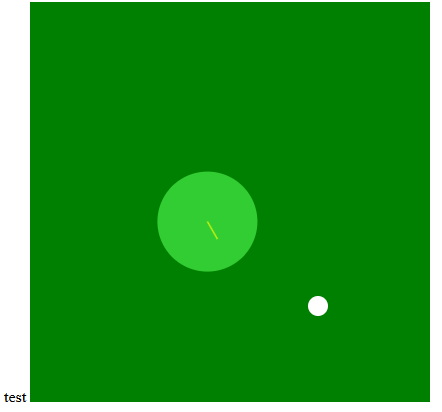
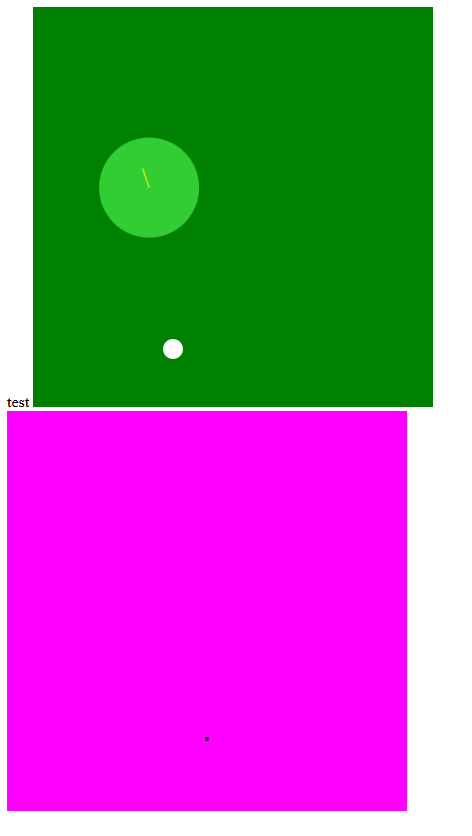
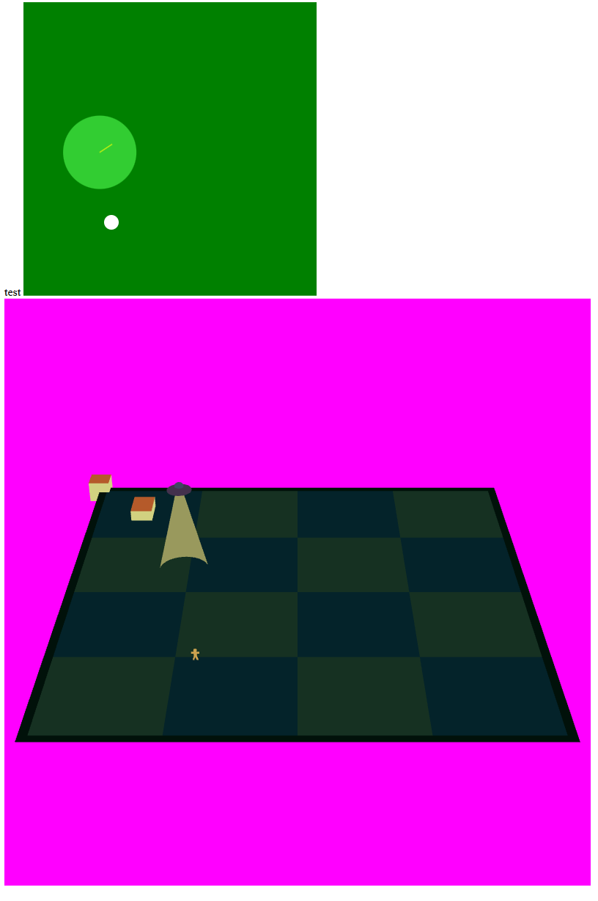

Jam home page https://itch.io/jam/trijam-383

Theme **You Were The Chosen One!**

Scoring
* Gameplay
* Visuals
* Audio
* Theme
* Enjoyment

## Dev Log

## Ideation
`16:00`

**Chosen**, like chosen by aliens for abduction.  (other considered options were Neo from the Matrix, or a hero, or a winner of something).

The word **were** could indicate that you could get out of being the chosen one

The idea is that there'sa typical UFO following you around slowly, picking up anything in its path. you can slow it down by picking up bombs or explosives or something

Movement is left-right-up-down. maybe jumping in the future.

The boiled-down gameplay can be considered from top down
* the UFO is moving in a direction. this direction can slowly turn to point towards you
* you run 1.1x as fast as the ufo moves
* the camera slides along the X axis to match the player
* the ufo has a bean (inside-out cone with backface culling), and a sotlight
* items can be as many as i want, inspired by katamari damacy
* anything under the UFO's area of effect starts to rise. once it hits a certain height, it keeps going up, and the x/y is parented to the ufo

Tools
* textures: Paint.net
* Models: Blender 3d
* Audio: Strudel REPL - if i have time

`16:04`

Let's get the project started

Then I implemented the UFO and player movement in 2d

The values to tweak are the speed difference, and the direction change speed

`16:28`

modelling, loading the scene, and setting the camera.

Setting the camera has been wasting a bit of time, and the texture won't load either, it's just black.

`17:00`

not accounted for - some research and code review to fix a bug

`10:06` back on it again

`10:24`

* Added items (cubes)
* Modelled player
* added floor
* adjusted camera and stuff

